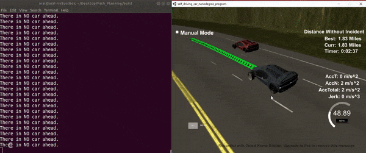

# Path Planning

This project implements a simple path planning logic unit to navigate the vehicle in a high-way driving scenario.

# Behavioural Planning Model Explanation
The behavioral planning model gets the information about the other vehicles on the from the sensor fusion module. The decision making is mainly based on the following three flags:

1) Car_ahead: Evaluates if there is a car ahead of our self-driving car.
2) Car_left: Evaluates if there is a car left of our self-driving car.
3) Car_right: Evaluates if there is a car right of our self-driving car.

Based on these three flags the behavioral planning module makes one of the following decisions:

1) If there is a car_ahead and there are no safe lanes to change: Reduce your speed, to avoid collision with the car in front of you.
2) If there is a car_ahead and there is a safe lane to change: Change lane to the safe lane (Right lane or Left lane).
3) If there is no car_ahead accelerate to reach the maximum allowed speed in the highway, and merge to the middle lane if possible. (Because by staying in the middle there will be more options for a lane change and in general, the car can navigate more easily in the traffic).

# Trajectory Generation Module

The trajectory generating module gets the lane, and desired velocity information from the behaviour planning module and generates the desired trajectories based on these information.

The spline library is used to generate smooth trajectories for the vehicle.
Moreover the , previous path point are also taken into account to avoid abrupt changes in the generated trajectories.

# Future Work
For futhure work a better path planning policy which works with a cost function can be considered to implement. A better planner can make better decisouns due to the fact that is includes the infromation from the near future in the cost function, and the vehicle can navigate more easily and efficiently in the high-way.
